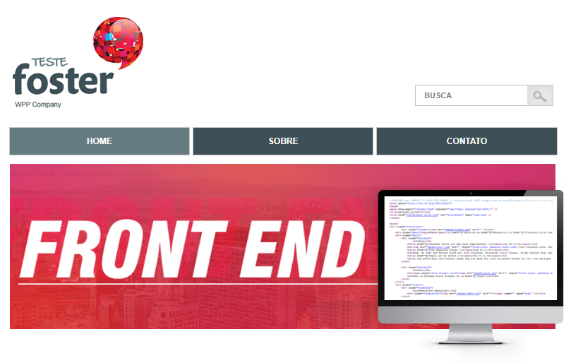
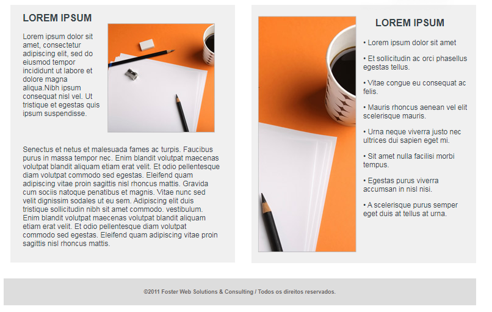

## Projeto - Projeto página Web - Teste Foster
### Centro Paula Souza - Fatec Ferraz - Curso de Análise e Desenvolvimento de Sistemas
- Diego Fernandes Lins
### Objetivo
Este projeto teve como objetivo implementar uma página web utilizando meus conhecimentos em HTML, CSS e JavaScript, com a principal meta de aperfeiçoar meus conhecimentos. 
## Amostra da página web 🔭 

